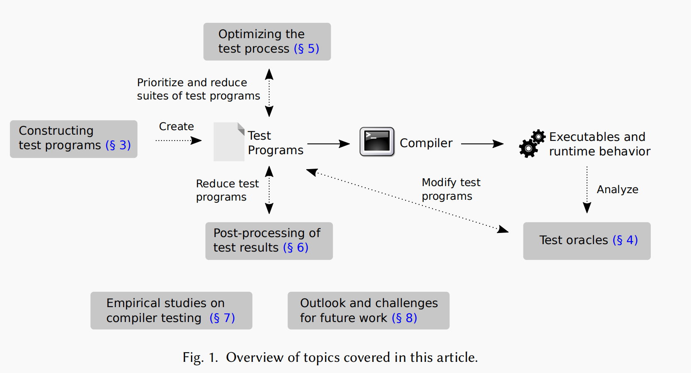
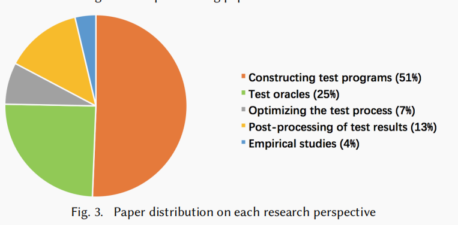

# A Survey of Compiler Testing(2019)

> **Abstract**:
>
> 这份调查包含了编译器测试领域不同的方向：
>
> - 如何构建测试程序
> - 来判断程序是否正确执行的test oracles
> - 如何更加高效地执行编译器测试
> - 如何在编译器测试后帮助开发者处理发现的bugs

## 1.  Introduction

简单介绍了一下各个子分支：

- 构建测试程序：第3节介绍了创建作为测试编译器输入的程序的方法。
- test oracles：第4节描述了确定编译器的行为或输出是否正确的方法。
- 优化测试过程：第5节讨论了如何提高编译器测试的效率
- Post-process of test result（测试结果后处理）：第6节介绍了帮助开发人员优先排序和理解通过编译器测试检测到的bug的方法。
- 实证研究：第7节讨论了为更好地理解编译器错误和编译器测试过程而进行的实证研究。

## 2.  Survey Methodology

构建测试程序以及test oracles是目前研究最多的两个方向。

另外值得一提的是，编译器测试方向的论文在2011年后开始变多……这很可能与Csmith以及Creduce的出现有关。

## 3. Constructing Testing Programs

构建测试程序是非常具有挑战性的事情。

- 手动构建：具体见下文

- 自动构建：自动方法要么生成程序片段并将它们连接成测试程序，要么突变现有程序

## 4. Test Oracles

## 5.  Optimizing the test process

## 6. post-processing of the test results

## 7.  Empirical Studies on Compiler Testing

## 8. Outlook and Challenges for Future Work

## 9. Conclusion

## 10. References

