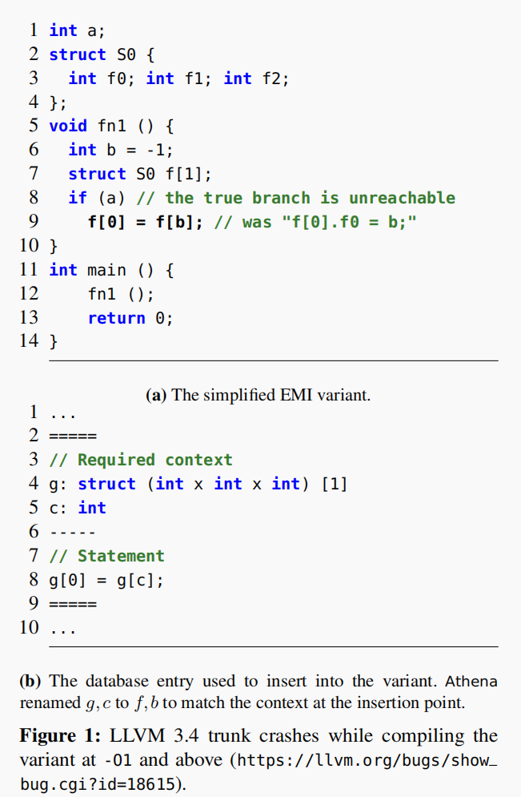
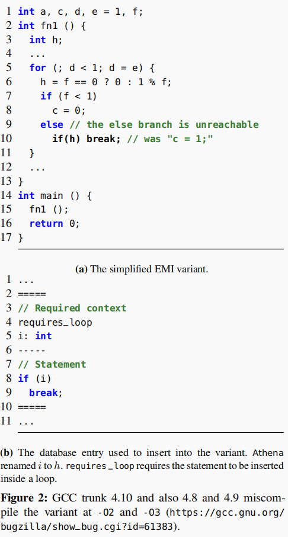

# Finding Deep Compiler Bugs via Guided Stochastic Program Mutation

## Abstract

> **Abstract**:
>
> 等效模块输入（EMI）是一种很有前途的编译器验证方式。它基于在某些输入下修改现有程序的未执行语句，以产生新的关于这些输入的等效测试程序。
>
> Orion是一个简单的EMI的实现——通过随机删除未执行的语句。尽管Orion在生产中成功发现了许多bug，但它的有效性仍然受到其简单、盲目的突变策略的限制。
>
> 为了更有效地实现EMI，本文提出了一种基于贝叶斯优化的引导性、先进的突变策略。我们的目标是生成不同的程序来更彻底地练习编译器。我们通过两种技术来实现这一点： 
>
> (1)支持在未执行区域中的代码删除和插入，导致更大的测试程序空间；
>
> (2)使用目标函数，促进控制流多样性程序，指导马尔可夫链蒙特卡罗（MCMC）优化，以探索搜索空间。
>
> 我们的技术可以帮助发现需要复杂突变的深层漏洞。我们的实现是，Athena，我们的目标是C编译器。在19个月的时间里，Athena在GCC和LLVM中发现了72个新的漏洞，其中许多是深层而重要的漏洞。开发人员已经确认了所有72个错误，并修复了其中的68个。

## Introduction

保证编译器的安全正确执行非常重要，一些方法如下：

- 开发经过验证的编译器，它保证编译后的可执行文件的行为完全按照其源程序的语义的定义（CompCert）
- 测试仍然是验证主流编译器的主要方法。特别是，随机程序生成器（模糊器）已经被开发出来并在实践中证明是有效的（jsfunfuzz/Csmith）

为了补充现有的编译器测试方法，我们引入了等价模输入（EMI），这是一种从现有代码构建有效测试程序的通用方法。给定一个现有的程序和它的一些输入，我们在给定的输入下描述了程序的执行情况。然后，我们通过随机修剪未执行的代码来生成额外的测试程序（从此以后称为变体）。

EMI不需要不同的编译器实现，因为变体的语义是已知的——它们必须在相同的分析输入下与原始程序的行为完全相同。我们对EMI的实现，在GCC和LLVM中发现了147个新的错误，大部分是错误编译。

**Orion的局限性**：虽然是有效的，但它有几个技术上的限制，主要涉及到它生成变体的简单策略——它只随机删除未执行的语句

- 第一，有限的变量
- 第二，控制流和数据流多样性不足
- 第三，纯随机

本文提出了一种有效的技术来解决这些局限性。首先，除了删除之外，我们还支持将代码插入到未执行的程序区域中。因为我们可以潜在地在这些区域中插入无限数量的语句，所以我们可以生成大量的变体。更重要的是，生成的变体具有大量不同的控制流和数据流，因此可以帮助更彻底地使用编译器。我们的实验结果表明，增加的变化和复杂性对于揭示更多的编译器错误是至关重要的。

其次，我们介绍了一种新的方法来指导生成过程，以发现深层错误。我们将我们的错误发现过程表述为一个优化问题，其目标是最大化一个变体和种子程序之间的差异。通过生成大量不同的变体，我们的目标是测试更多的优化策略。我们使用马尔可夫链蒙特卡罗（MCMC）技术实现了这一过程，这有助于有效地采样程序空间，以允许不同的程序。我们的评估结果表明，这种方法在发现需要长时间的种子程序上的复杂突变序列的深层bug方面非常有效。我们的研究结果还表明，大多数这些bug都不能被Orion发现，而Orion只使用了一种简单得多的盲突变策略。

## Approach

这两个bug都从Csmith 生成的种子程序开始，并由一系列突变序列触发，即插入和删除来自种子的语句。

### LLVM

### GCC

## Background

### EMI(Equivalence Modulo Inputs)

程序P和程序Q对于同一个输入I，他们的表现相同，则这两个程序被定义为输入I上相同的模块：
$$
[[P]]=_I[[Q]] \Leftrightarrow ∀i∈I[[P]](i)=[[Q]](i)
$$

特性：

EMI可以单独地测试编译器，因为生成的变体的预期语义是已知的（即，产生与I上的P相同的输出）。如果我们不知道程序的语义，比如由模糊器生成的语义，我们必须依赖多个编译器来找到编译的可执行文件之间的潜在差异。

EMI的另一个吸引人的特性是，如果种子程序本身是有效的，那么生成的变体总是有效的。相反，从程序中随机删除语句很可能会产生无效的程序，即那些具有未定义行为的程序。

### MCMC( Markov Chain Monte Carlo)

额，[wiki百科的解释](https://en.wikipedia.org/wiki/Markov_chain_Monte_Carlo)可能直观一些~

## MCMC-guided compiler testing methodology

## Athena

## Results

## Related work

## Conclusion

